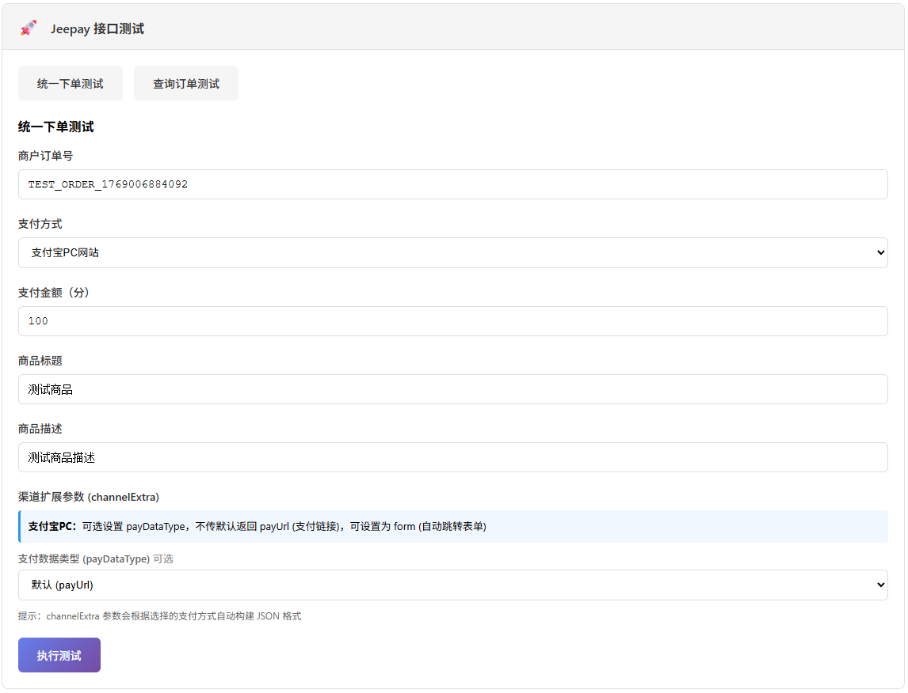
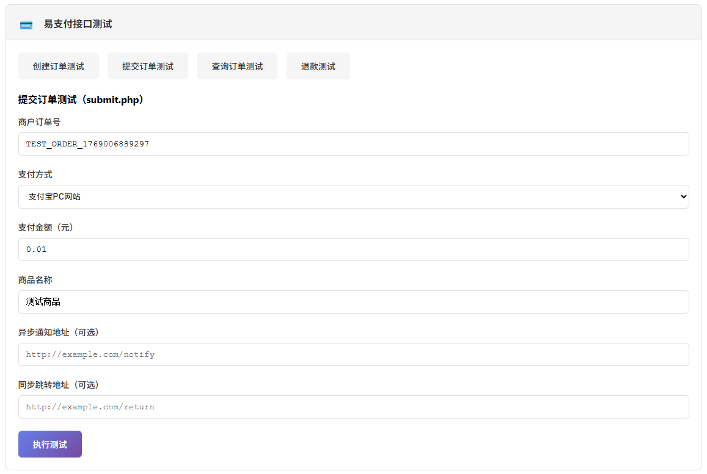
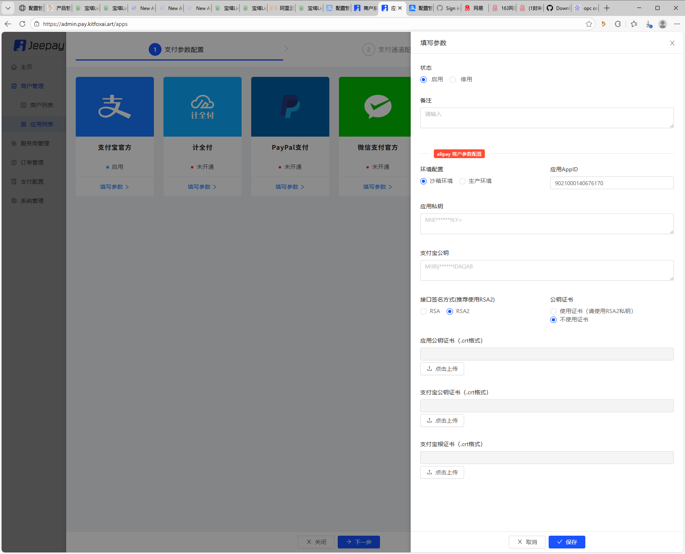
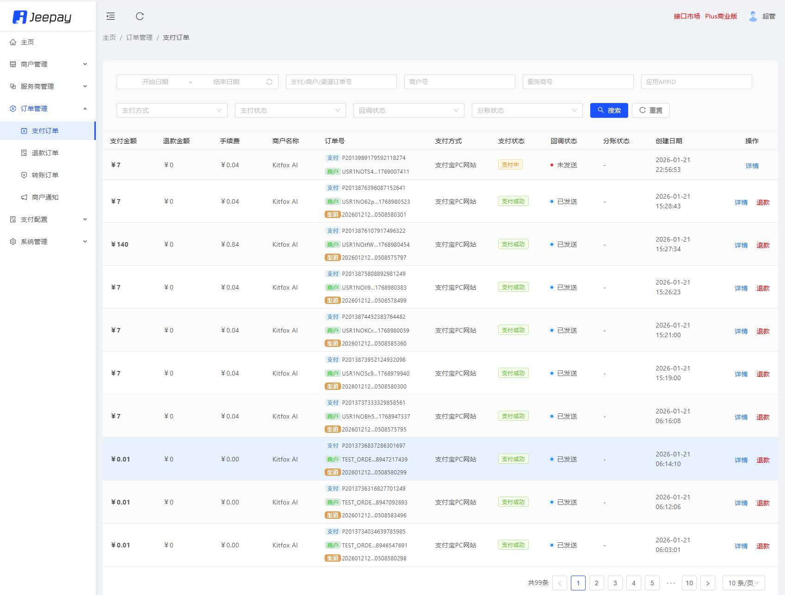
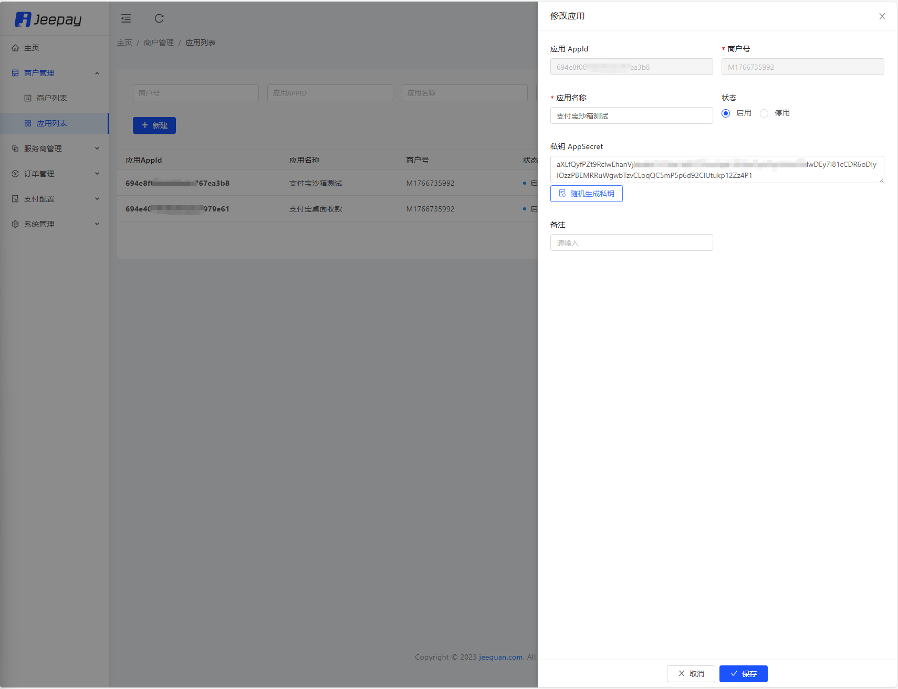
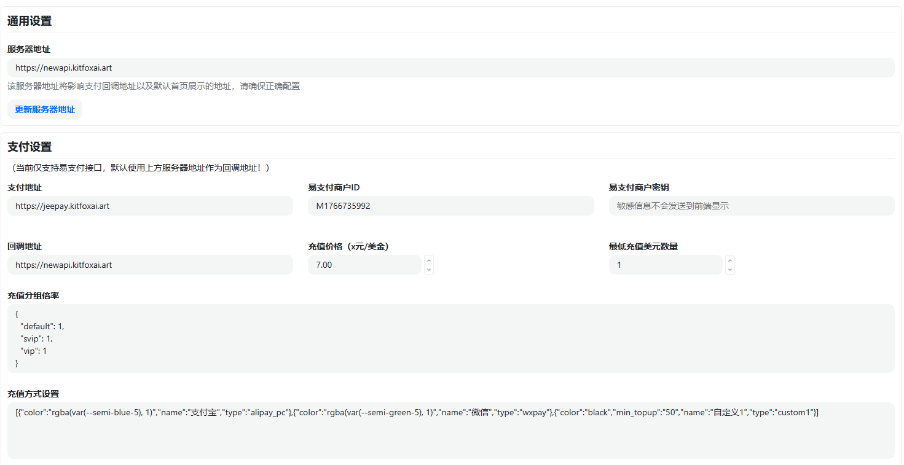
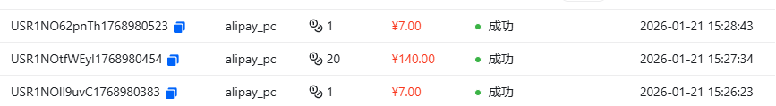

# KitfoxPay：让 NewAPI 无缝接入 Jeepay 的开源支付适配网关

> **一句话定位**：解决 NewAPI 支付通道受限问题的开源适配网关，无需修改 NewAPI 代码即可接入 Jeepay，升级更平滑、支付更可控。

---

## 一、项目背景：为什么需要 KitfoxPay？

### NewAPI 的支付通道困境

如果你正在使用 **NewAPI**（一个开源的大模型网关和资产管理系统），你可能已经遇到过这样的问题：

**官方目前只支持易支付、Stripe、Creem 等少数几个支付通道。**

对于国内用户来说，这个限制带来了不少困扰：

- **易支付是第三方平台**：虽然接入方便，但在支付通道的丰富度、安全性和可控性上仍然有不少遗憾
- **希望使用更成熟的开源支付系统**：比如 Jeepay，它开源、可自建部署、更细粒度地掌控资金流转
- **但直接修改 NewAPI 代码成本太高**：只要一改动核心代码，以后每次 NewAPI 发布新版本，就要跟着手动同步、合并、解决冲突，升级成本会越来越高

### 我们的解决方案

为了既能继续享受 NewAPI 带来的迭代升级，又能在支付层面拥有更多选择、更高安全性和可控性，我们决定换一种思路：

**做一个与易支付接口完全兼容的"支付适配器中间网关"。**

这样，NewAPI 仍然认为自己在调用易支付接口，实际底层则由这个中间网关去对接真正的支付平台——**第一步我们选择了开源且在国内实践比较成熟的 Jeepay，后续也可以逐步适配更多支付通道**。

这就是 **KitfoxPay** 诞生的原因：它既是给 NewAPI 用户准备的一块"可插拔支付底座"，也是一块可以被其他系统重复使用的**聚合支付适配层**。

---

## 二、KitfoxPay 是什么？能做什么？

### 核心定位

KitfoxPay 是一个**支付适配器中间网关**，它：

- ✅ **兼容易支付接口标准**：NewAPI 无需修改任何代码，只需将支付接口地址指向 KitfoxPay
- ✅ **底层对接 Jeepay**：使用开源可控的 Jeepay 支付平台，支持自建部署
- ✅ **实现平滑升级**：NewAPI 的支付逻辑与业务逻辑完全解耦，升级 NewAPI 时不再需要手动合并支付相关代码
- ✅ **可扩展架构**：采用适配器模式，后续可以轻松接入更多支付通道

### 核心功能

1. **支付订单创建**
   - 支持多种支付方式（微信、支付宝等，具体取决于 Jeepay 配置）
   - 自动处理金额转换、签名验证、参数映射

2. **支付结果通知**
   - 接收 Jeepay 的异步通知
   - 自动转换为易支付格式并转发给 NewAPI
   - 支持支付成功、失败、退款等多种通知类型

3. **订单查询**
   - 支持单个订单查询、批量订单查询
   - 实时同步订单状态

4. **退款功能**
   - 支持全额退款、部分退款
   - 自动处理退款通知转发

5. **商户信息查询**
   - 查询商户基本信息
   - 查询结算记录

6. **可视化配置管理**
   - 提供 Web 管理界面，无需手动编辑配置文件
   - 支持 Jeepay 配置、易支付接口配置、服务器配置等


*图：KitfoxPay 可视化配置管理界面 - 网站设置 Tab*


*图：KitfoxPay 可视化配置管理界面 - Jeepay 配置 Tab*


*图：KitfoxPay 可视化配置管理界面 - 易支付配置 Tab*

---

## 三、功能特性亮点

### 1. 零代码改动，即插即用

- NewAPI 完全不需要修改代码
- 只需在 NewAPI 配置中将支付接口地址改为 KitfoxPay 的地址
- 所有接口参数、签名方式、响应格式完全兼容

### 2. 平滑升级，解耦维护

- NewAPI 的支付逻辑与业务逻辑完全解耦
- 升级 NewAPI 时，KitfoxPay 独立维护，互不影响
- 不再需要每次升级都手动合并支付相关代码

### 3. 开源可控，安全可靠

- 底层使用开源 Jeepay 支付平台
- 支持自建部署，数据完全可控
- 所有代码开源，可审计、可定制

### 4. 可扩展的适配器架构

- 采用适配器模式设计
- 当前支持 Jeepay，后续可以轻松扩展其他支付通道
- 每个支付通道独立模块，互不干扰

### 5. 完善的接口支持

- 支持易支付的所有核心接口：
  - `mapi.php` - 后端 API 支付接口
  - `submit.php` - 前台支付提交接口
  - `api.php` - 统一 API 接口（订单查询、退款、商户查询等）
- 支持 GET 和 POST 两种请求方式
- 完整的签名验证机制

### 6. 友好的管理界面

- 提供 Web 配置管理界面
- 可视化配置 Jeepay 参数、易支付接口参数
- 支持配置热更新，无需重启服务



*图：KitfoxPay 调试界面 - Jeepay 接口测试*



*图：KitfoxPay 调试界面 - 易支付接口测试*

---

## 四、技术栈与架构设计

### 技术栈

- **运行环境**：Node.js（建议 14.x 及以上版本）
- **Web 框架**：Express.js
- **核心依赖**：
  - `express` - Web 服务器框架
  - `axios` - HTTP 客户端（用于调用 Jeepay API 和转发通知）
  - `cors` - 跨域支持
  - `express-session` - Session 管理（用于管理后台认证）

### 架构设计

```
┌─────────────────┐
│   NewAPI        │
│  (业务系统)      │
└────────┬────────┘
         │ 易支付接口调用
         │ (mapi.php / submit.php / api.php)
         ▼
┌─────────────────┐
│   KitfoxPay     │
│  (适配器网关)    │
│                 │
│  ┌───────────┐  │
│  │ EpayAdapter│ │  ← 易支付接口适配层
│  └─────┬─────┘  │
│        │        │
│  ┌─────▼─────┐  │
│  │JeepayClient│ │  ← Jeepay 客户端
│  └─────┬─────┘  │
└────────┼────────┘
         │ Jeepay API 调用
         ▼
┌─────────────────┐
│   Jeepay        │
│  (支付平台)      │
└─────────────────┘
```

### 核心模块说明

1. **`index.js`** - 主入口文件
   - 初始化 Express 服务器
   - 注册路由（易支付接口路由、Jeepay API 路由、管理后台路由）
   - 处理支付通知和退款通知

2. **`epay.js`** - 易支付接口适配器
   - 实现易支付接口标准（`mapi.php`、`submit.php`、`api.php`）
   - 参数转换（易支付格式 ↔ Jeepay 格式）
   - 签名生成与验证
   - 通知格式转换与转发

3. **`jeepay/jeepay.js`** - Jeepay 客户端
   - 封装 Jeepay API 调用
   - 签名生成与验证
   - 统一下单、订单查询、退款等接口

4. **`admin.js`** - 管理后台 API
   - 配置管理接口
   - 登录认证
   - 配置热更新

5. **`public/index.html`** - Web 管理界面
   - 可视化配置管理
   - 配置测试功能

6. **`config.js`** - 配置文件
   - Jeepay 配置（baseUrl、商户号、应用ID、私钥）
   - 易支付接口配置（商户ID、密钥）
   - 服务器配置（端口、域名）

### 扩展新的支付通道

如果你需要接入除 Jeepay 之外的其他支付通道，可以按照以下步骤：

1. 创建新的支付客户端模块（参考 `jeepay/jeepay.js`）
2. 在 `epay.js` 中扩展适配逻辑，将易支付参数转换为新通道的参数格式
3. 在 `index.js` 中注册新通道的路由和通知处理

这种设计使得扩展新通道变得非常简单，且不会影响现有功能。

---

## 五、快速上手（Getting Started）

### 环境要求

- Node.js 14.x 及以上版本
- npm 或 yarn 包管理器
- 已部署的 Jeepay 支付平台（或使用 Jeepay 官方提供的测试环境）

### 安装步骤

#### 1. 克隆仓库

```bash
# GitHub
git clone https://github.com/kitfoxai/kitfoxpay.git
# 或 Gitee（国内用户推荐）
git clone https://gitee.com/kitfoxai/kitfoxpay.git

cd kitfoxpay
```

#### 2. 安装依赖

```bash
npm install
# 或
yarn install
```

#### 3. 配置参数

**首先，需要在 Jeepay 后台获取配置信息：**
- 商户号（mchNo）
- 应用ID（appId）
- 商户私钥（privateKey）

具体获取方法请参考下方"界面展示"部分的截图说明。

**然后，复制配置示例文件并填入真实配置：**

```bash
cp config.example.js config.js
```

编辑 `config.js`，填入以下信息：

```javascript
module.exports = {
  // Jeepay 支付平台配置
  jeepay: {
    baseUrl: 'https://pay.jeepay.vip',   // Jeepay API 基础地址
    mchNo: '你的商户号',                   // 商户号
    appId: '你的应用ID',                  // 应用ID
    privateKey: '你的商户私钥'            // 商户私钥
  },

  // 易支付接口配置（适配器）
  epay: {
    pid: '你的易支付商户ID',
    key: '你的易支付密钥'                 // MD5 签名密钥
  },

  // 服务器配置
  server: {
    host: '0.0.0.0',                      // 绑定 IP
    port: 9219,                           // 监听端口
    siteDomain: 'http://localhost:9219'   // 对外访问域名
  },

  // 管理后台配置
  admin: {
    password: '请修改为安全密码'
  }
};
```

#### 4. 启动服务

```bash
npm start
# 或
node index.js
```

看到以下输出表示启动成功：

```
=================================
支付平台 API 服务已启动
绑定地址: 0.0.0.0:9219
服务地址: http://localhost:9219
=================================
```

#### 5. 访问管理界面

在浏览器中打开：`http://localhost:9219`

你可以通过 Web 界面进行配置管理，无需手动编辑配置文件。界面展示请参考下方"界面展示"部分。

### 在 NewAPI 中配置

在 NewAPI 的配置文件中，将支付接口地址改为 KitfoxPay 的地址：

```yaml
# NewAPI 配置示例
payment:
  epay_url: http://your-kitfoxpay-domain:9219  # 改为 KitfoxPay 地址
  pid: 你的易支付商户ID
  key: 你的易支付密钥
```

**注意**：`pid` 和 `key` 需要与 KitfoxPay 的 `config.js` 中的 `epay.pid` 和 `epay.key` 保持一致。

### 测试支付流程

1. 在 NewAPI 中创建一个测试订单
2. 选择易支付作为支付方式
3. 订单会通过 KitfoxPay 转发到 Jeepay
4. 完成支付后，Jeepay 会通知 KitfoxPay，KitfoxPay 再通知 NewAPI

完整的支付流程界面演示请参考下方"界面展示"部分。

---

## 六、界面展示

### KitfoxPay 管理界面

启动服务后，访问 `http://localhost:9219` 即可进入管理界面。界面采用 Tab 设计，将不同配置分类管理：


*图：KitfoxPay 可视化配置管理界面 - 网站设置 Tab*


*图：KitfoxPay 可视化配置管理界面 - Jeepay 配置 Tab*


*图：KitfoxPay 可视化配置管理界面 - 易支付配置 Tab*

### Jeepay 后台配置获取

在配置 KitfoxPay 之前，需要先在 Jeepay 后台获取必要的配置信息：



*图：在 Jeepay 后台获取商户号和应用ID（1）*



*图：在 Jeepay 后台获取商户号和应用ID（2）*



*图：在 Jeepay 后台获取商户私钥*

### NewAPI 配置与支付流程

在 NewAPI 系统中配置支付接口：



*图：在 NewAPI 系统中配置支付接口地址和相关参数*

支付流程演示：


*图：用户在 NewAPI 系统中发起支付 - 支付方式选择*


*图：用户在 NewAPI 系统中发起支付 - 支付确认*



*图：支付成功后的提示界面*

---

## 七、典型使用场景 & 适用人群

### 适用场景

1. **NewAPI 用户**
   - 希望使用 Jeepay 替代易支付
   - 希望 NewAPI 升级时不受支付代码影响
   - 需要更高的支付安全性和可控性

2. **其他使用易支付接口的系统**
   - 任何使用易支付接口标准的系统都可以通过 KitfoxPay 接入 Jeepay
   - 无需修改业务代码，只需更改支付接口地址

3. **需要多支付通道聚合的场景**
   - 未来可以扩展支持多个支付通道
   - 通过 KitfoxPay 统一管理，业务系统只需对接一套接口

### 适用人群

- **开发者**：希望快速接入 Jeepay，不想修改现有业务代码
- **运维人员**：需要可控的支付网关，支持自建部署
- **技术团队**：需要支付逻辑与业务逻辑解耦，便于维护和升级

---

## 八、开源协议 & 贡献方式

### 开源协议

KitfoxPay 采用 **MIT 协议**开源，你可以自由使用、修改、分发。

### 如何参与贡献

我们欢迎所有形式的贡献！

#### 提交 Issue

如果你发现了 Bug 或有功能建议，欢迎提交 Issue：

- Bug 报告：请详细描述问题现象、复现步骤、环境信息
- 功能建议：请说明需求场景和预期效果

#### 提交 Pull Request

1. Fork 本仓库
2. 创建你的特性分支（`git checkout -b feature/AmazingFeature`）
3. 提交你的更改（`git commit -m 'Add some AmazingFeature'`）
4. 推送到分支（`git push origin feature/AmazingFeature`）
5. 开启一个 Pull Request

#### 代码规范

- 遵循现有代码风格
- 添加必要的注释
- 确保代码通过测试

### Roadmap（规划中）

- [ ] 支持更多支付通道（如其他聚合支付平台）
- [ ] 增强管理后台功能（订单查询、统计报表等）
- [ ] 支持多商户配置
- [ ] 添加监控和日志系统
- [ ] 提供 Docker 镜像
- [ ] 编写更详细的文档和教程

---

## 九、仓库信息 & 联系方式

### 代码仓库

**GitHub**：[https://github.com/kitfoxai/kitfoxpay](https://github.com/kitfoxai/kitfoxpay)

**Gitee**：[https://gitee.com/kitfoxai/kitfoxpay](https://gitee.com/kitfoxai/kitfoxpay)

如果这个项目对你有帮助，欢迎给个 ⭐ Star！

### 联系方式

- **Issue**：在 [GitHub Issues](https://github.com/kitfoxai/kitfoxpay/issues) 或 [Gitee Issues](https://gitee.com/kitfoxai/kitfoxpay/issues) 上提交
- **讨论**：欢迎在 GitHub Discussions 中交流

### 致谢

- 感谢 [Jeepay](https://github.com/jeequan/jeepay) 提供优秀的开源支付平台
- 感谢 [NewAPI](https://github.com/newapi) 提供的大模型网关和资产管理系统
- 感谢所有贡献者和使用者的支持

---

## 写在最后

KitfoxPay 的诞生源于实际使用中的痛点，我们希望它能够帮助更多 NewAPI 用户解决支付通道受限的问题。

如果你觉得这个项目有用，欢迎：

- ⭐ **Star** 这个项目
- 🐛 **提交 Issue** 报告问题或建议
- 🔧 **提交 PR** 贡献代码
- 📢 **分享** 给需要的朋友

让我们一起让 NewAPI 的支付体验变得更好！

---

**最后更新**：2026年

**版本**：v1.0.0
